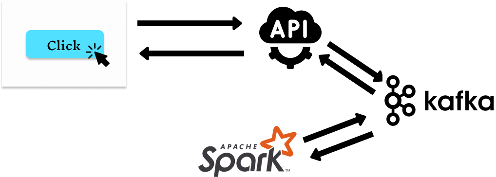
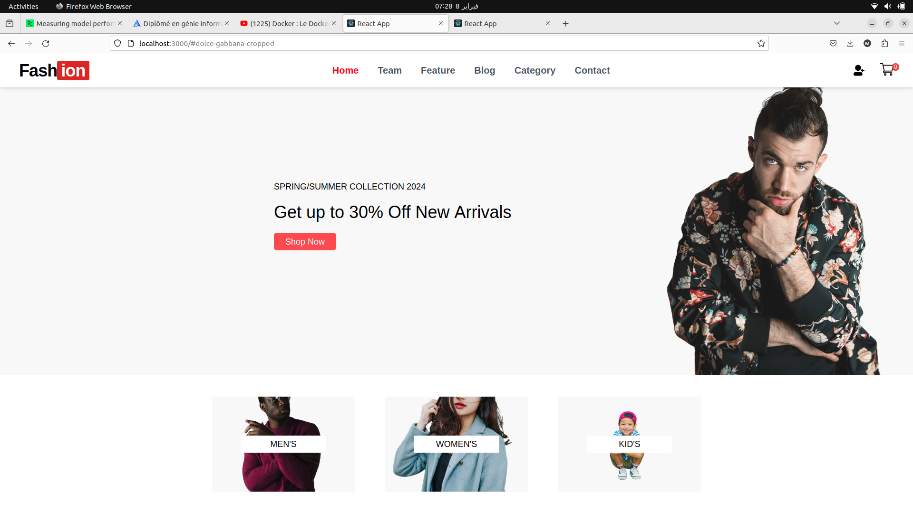
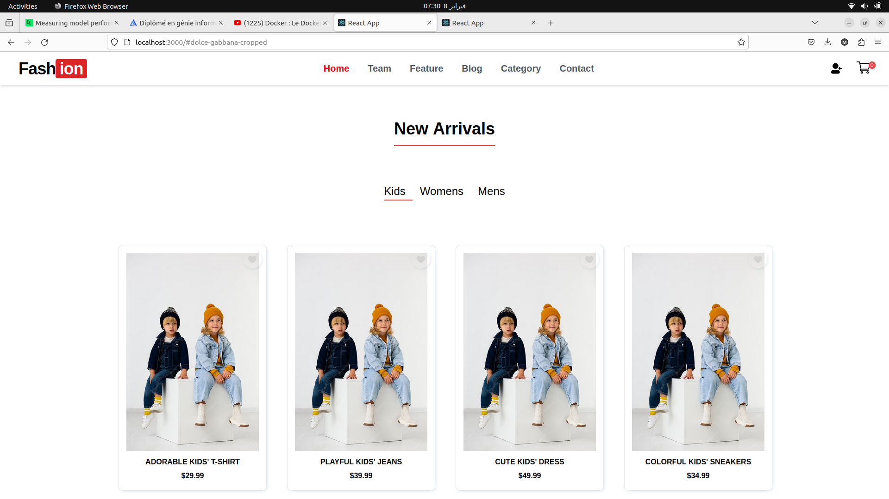
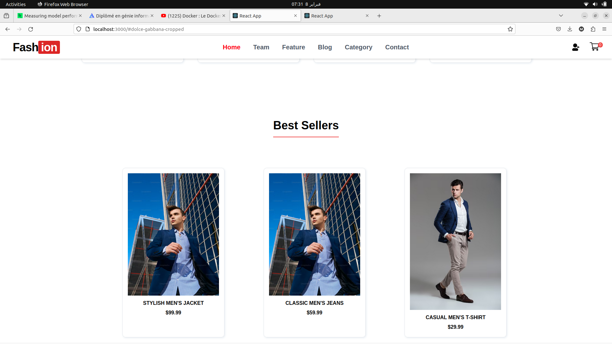
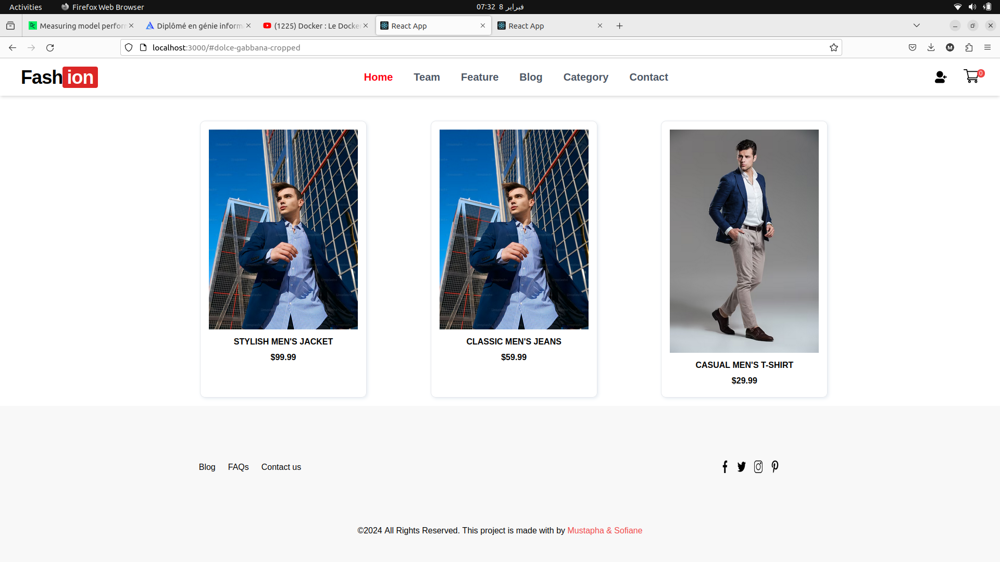

# Real-time User Activity Tracking System for E-commerce Websites using Apache Spark and Apache Kafka

## description
> **The project aims to develop a straightforward system for monitoring user clicks on an e-commerce platform. The workflow of the project is as follows: Upon a user's click on a product of interest, an event containing pertinent information, including the clicked product and the user initiating the action, is generated and dispatched to a Flask API. Subsequently, the Flask API forwards this event to a Kafka topic. A Spark streaming application then processes the data retrieved from the Kafka topic. Specifically, Spark analyzes the incoming events to ascertain the top 5 products that have received the most clicks. Following this determination, Spark transmits this information to another Kafka topic. This second Kafka topic serves as the endpoint for consumption by the API, which retrieves the contents and relays them to a frontend dashboard. The dashboard, facilitated by WebSocket technology, displays the real-time results to users, thereby enabling instantaneous monitoring of the most-clicked products.**
 

# Environment Setup
